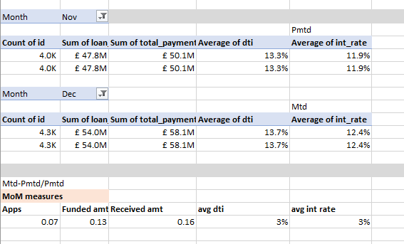

# Financial Loan Analysis

## Table of Contents

- [Project brief](#Project-brief)
- [Objective](#Objective)
- [Questions to Answer](#Questions-to-Answer)
- [Data source](#Data-source)
- [Tools](#Tools)
- [Dashboard design charts](#Dashboard-design-charts)
- [Development](#Developments)
- [Data processing / Transformation](#Data-processing-Transformation)
- [Findings](#Findings)
- [Recommendations](#Recommendations)

## Project brief
Financial Loan Analysis

## Objective
This report aims to provide insights into key loan-related metrics and their changes over time. The report will help us make data-driven decisions, track our loan portfolio's health, and identify trends that can inform our lending strategies.

## Questions to answer

1.	Total Loan Applications: We need to calculate the total number of loan applications received during a specified period. Additionally, it is essential to monitor the Month-to-Date (MTD) Loan Applications and track changes Month-over-Month (MoM).

2.	Total Funded Amount: Understanding the total amount of funds disbursed as loans is crucial. We also want to keep an eye on the MTD Total Funded Amount and analyse the Month-over-Month (MoM) changes in this metric.

3.	Total Amount Received: Tracking the total amount received from borrowers is essential for assessing the bank's cash flow and loan repayment. We should analyse the Month-to-Date (MTD) Total Amount Received and observe the Month-over-Month (MoM) changes.

4.	Average Interest Rate: Calculating the average interest rate across all loans, MTD, and monitoring the Month-over-Month (MoM) variations in interest rates will provide insights into our lending portfolio's overall cost.

5.	Average Debt-to-Income Ratio (DTI): Evaluating the average DTI for our borrowers helps us gauge their financial health. We need to compute the average DTI for all loans, MTD, and track Month-over-Month (MoM) fluctuations.

6.	Good & Bad Loan Application Percentage: We need to calculate the percentage of loan applications classified as 'Good Loans.' This category includes loans with a loan status of 'Fully Paid' and 'Current.'

7.	Good & Bad Loan Applications: Identifying the total number of loan applications falling under the 'Good Loan' category, which consists of loans with a loan status of 'Fully Paid' and 'Current.'

8.	Good & Bad Loan Funded Amount: Determining the total amount of funds disbursed as 'Good Loans.' This includes the principal amounts of loans with a loan status of 'Fully Paid' and 'Current.'

9.	Good & Bad Loan Total Received Amount: Tracking the total amount received from borrowers for 'Good Loans,' which encompasses all payments made on loans with a loan status of 'Fully Paid' and 'Current.'

## Dataset

## Data source
Here are the Data needed to achieve project goal

1.  Total loan applications (Month-to-date, Month-over-Month)
2.  Funded Amount (Month-to-date, Month-over-Month)
3.  Received amount (Month-to-date, Month-over-Month)
4.  Average Interest rate (Month-to-date, Month-over-Month)
5.  Average Debt to Income (Month-to-date, Month-over-Month)
6.  Home ownership
7.  Loan status
8.  Loan purpose
9.  Employment status
10.  Monthly trends
11.  Loan term

## Tools

| Tools | Purpose | 
| --- | --- | 
| SQL  |  Cleaning, Standardization. |
| Excel | Processing, Visualizations. | 

## Dashboard design

Here is a list of appropriate chart visuals used answering key questions.
1.	Score cards
2.	Column chart
3.	Donut chart
4.	Line chart
5.	Scatter chart
6.	Tree map
7.	Bar chart
8.	Slicers

## Development

Here’s a step by step guide on how the data was approached 

1.	Getting the data
2.	Load and clean data with SQL queries
3.	Transfer data from SQL database into Excel
4.	Processing and Visualizations using Excel
5.	Generate Insights
6.	Give recommendations 

## Data Cleaning / Processing 

The goal is to refine the dataset to ensure its clean and ready for analysis.

- Only relevant columns should be retained.
- All data types should be appropriate for the contents of each column.
- No column should contain null values, indicating complete data for all records

## SQL Cleaning

## Excel Processing 

## Findings

1.	Classic pizza outshines every other pizzas with the highest order and revenue. Supreme made the second spot, while chicken and veggie have a slight difference between them.

2.	Pizza with the “L” size performs significantly higher than other size whilst pizza with the “xxl” size performs very low compare to others.

3.	The month of February & December generated low revenue but September & October are lowest in both revenue and quantity sold.

4.	Pizzas are mostly ordered by weekends than midweek and at dinner, lunch and evening with dinner topping the list.

5.	Classic deluxe performs best, with Barbecue chicken, Hawaii pizza, Pepperoni pizza and Thai chicken having slight or no difference between them. 

6.	Soppresata, Spinach, Calabrese, Mediterranean and Brie-carrie pizza performs the lowest.

## Recommendations

1.	Increase in production of Pizza with “L” size should be made priority as it performs the best.

2.	Pizzas categories are doing well but the strategy used for the Classic pizza can be applied to others in the same category as there’s slight difference between them.

3.	Increase in production should be prioritize by mid-year starting from March-August and towards ending and new year (November-January). As sales seems to skyrocket at midyear.

4.	Plan for the increase in weekends pizza production than midweek.

5.	Least selling pizza production needs to be halted and invest more on top performing ones. 

